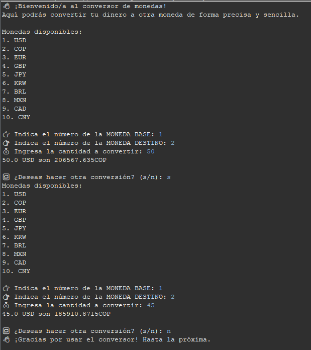

# 💱 Conversor de Monedas

Una aplicación Java pura que te permite convertir montos entre diferentes monedas usando tasas de cambio reales obtenidas desde una API externa. Ideal para practicar conceptos fundamentales de Java como manejo de clases, consumo de APIs, uso de bibliotecas externas y colecciones.

---

## 🚀 Características

- Conversión precisa entre múltiples monedas.
- Interfaz en consola amigable e interactiva.
- Validación de entradas del usuario.
- Registro de historial con fecha y hora de cada conversión.
- Uso de librerías externas como **Gson** para parseo de JSON.
- Arquitectura organizada por paquetes.

---

## 🧠 Conceptos prácticos aplicados

- Programación orientada a objetos (POO).
- Consumo de APIs usando `HttpURLConnection`.
- Deserialización de JSON con **Gson**.
- Uso de colecciones como `Map` y `List`.
- Fechas y horas con `LocalDateTime`.
- Buenas prácticas: separación por responsabilidades, nombres claros, código reutilizable.

---

## 🖥️ Requisitos

- Java 17 o superior
- Eclipse o cualquier IDE de tu preferencia
- Conexión a internet (para obtener las tasas de cambio)
- Biblioteca Gson: `gson-2.10.1.jar`

---

## 📦 Estructura del Proyecto

conversorDeMonedas/
│
├── src/
│ ├── com.conversor.main/Principal.java
│ ├── com.conversor.servicio/ClienteHttp.java
│ ├── com.conversor.conversorDeMonedas/ConversorDeMonedas.java
│ └── com.conversor.HistorialConversion/HistorialConversion.java
│
├── lib/
│ └── gson-2.10.1.jar

---

## ▶️ ¿Cómo ejecutar el proyecto?

1. **Clona el repositorio:**

   ```bash
   git clone https://github.com/Natams7526/conversor-de-monedas.git
   
2. **Importa el proyecto en Eclipse:**

  -Ve a File > Import > Existing Java Project.

  -Selecciona la carpeta clonada.

3. **Agrega la librería Gson:**

  -Clic derecho sobre el proyecto > Build Path > Configure Build Path.

  -Ve a la pestaña Libraries > Add External JARs... y agrega gson-2.10.1.jar.

4. ** Ejecuta el programa:**

  -Abre la clase Principal.java.

  -Haz clic derecho > Run As > Java Application.


## 🧪 Ejemplo de uso

👋 ¡Bienvenido/a al conversor de monedas!
👉 MONEDA BASE: 1
👉 MONEDA DESTINO: 2
💰 Cantidad: 100

100 USD son 398000 COP

🔁 ¿Otra conversión? (s/n): n

## 📸 Captura de pantalla


